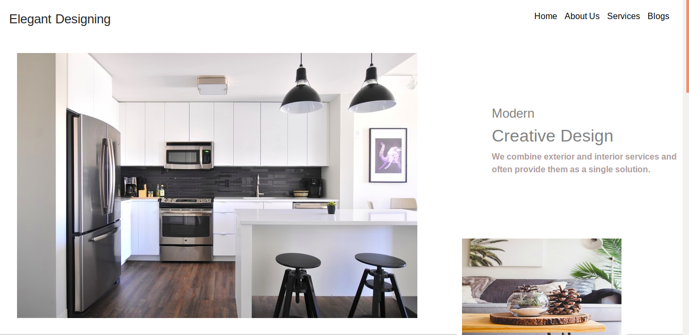
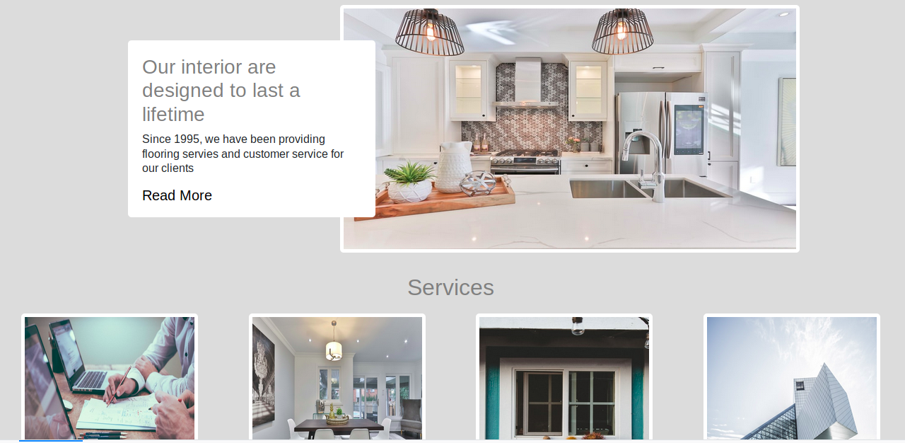

# Interior-design
An interior design webpage.

## Built With
### Technologies used
- HTML
- CSS
- Bootstrap

## Live Demo

[Live Demo Link](https://fatymahmed.github.io/Interior-design/)

## Getting Started

To get a local copy up and running follow these simple example steps.

- Clone the project to your local directory

- git clone git@github.com:fatymahmed/Interior-design.git

- Open the html file on any browser

## Authors

👤 **Fatima Ahmed**

- Github: [@githubhandle](https://github.com/fatymahmed)
- Twitter: [@twitterhandle](https://twitter.com/fatymahmed)
- Linkedin: [linkedin](https://www.linkedin.com/in/fatimahmed/)
- Contact me at fatima.ahmed.muhsin@gmail.com

## Acknowledgments
- The design of the website was inspired by [Aminul Haque Chowdhruy](https://dribbble.com/shots/9239203-Interior-Design-Landing-Page-Concept/attachments/1282846?mode=media)

- Photos by Dane Deaner, Sidekix Media, Helloquence, Lance Anderson and Naomi Hébert from [unsplash](https://unsplash.com/)
